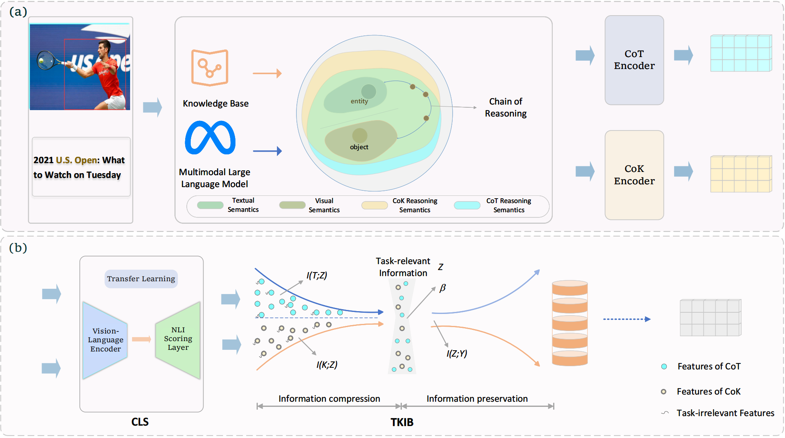

# Source Code of DCRN for Multimodal Relation Extraction

Implementation of our Paper “Learning Dual-Chain Based Representation for Multimodal Relation Extraction” (Authors: Yongkang Yang, Lihong Zhong, Defeng Kong, Shipeng Liu,  Junjian Li and Wei She).


## Model Architecture




## Required Environment

To run the codes, you need to install the requirements for MRE.

```
transformers==4.11.3
tensorboardX==2.4
TorchCRF==1.1.0
wandb==0.12.1
torchvision==0.8.2
torch==1.7.1
scikit-learn==1.0
seqeval==1.2.2
```

## Data Preparation

+  [MNRE](https://github.com/thecharm/MNRE)

* [MORE](https://github.com/NJUNLP/MORE)

  

## Model Training

```shell
python run.py \
      --ckpt='your_re_ckpt_path' \
      --max_epoch=20 \
      --batch_size=16 \
      --lr=1e-5 \
      --sample_ratio=1.0
```

## Model Testing

The settings are similar for MRE testing:


```shell
python run.py \
      --ckpt='your_re_ckpt_path' \
      --max_epoch=20 \
      --batch_size=16 \
      --lr=1e-5 \
      --only_test \
      --sample_ratio=1.0 \
```

